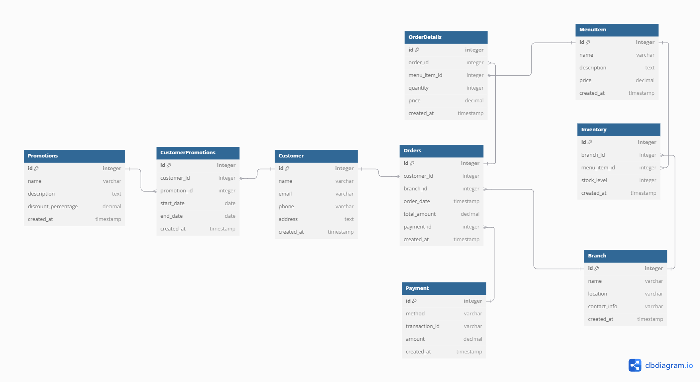

# Data Model Implementation for Analytics workloads

## 📖 Overview
The goal of this project is to build a data model/architecture that helps a restaurant streamline operations and make data-driven decisions related to inventory management, personalized customer engagement, and sales insights.

It covers: 

1. **Varying Menu Items Across Branches**: Managing inventory for items that differ from branch to branch is a challenge.
2. **Inventory Optimization**: Aligning stock levels with customer demand is difficult, leading to waste or shortages.
3. **Personalized Customer Engagement**: The restaurant needs to offer promotions tailored to individual customer preferences.
4. **Fragmented Sales Data**: Understanding sales across various branches, payment methods, and dining options (dine-in, take-out, online) is essential for decision-making.

This project delivers a **robust Entity-Relationship Data Model** and **PostgreSQL implementation** to address the company's interests. 

## ⚙️ Technology Stack

| Technology         | Purpose                                                    |
|--------------------|------------------------------------------------------------|
| **PostgreSQL**      | Relational database for storing and querying data          |
| **dbdiagram.io**    | Tool for visualizing ER diagrams                           |
| **PL/pgSQL**        | Procedural language for business logic in PostgreSQL       |
| **SQL**             | Language for defining tables, running queries, and managing data |

## 🗂️ Database Design Overview

### Key Entities:
- **Branch**: Each restaurant outlet.
- **Menu Item**: Menu items offered across different branches.
- **Inventory**: Stock levels of menu items at each branch.
- **Customer**: Details of customers for tracking orders and preferences.
- **Order**: Captures information about customer orders.
- **Order Details**: Itemized breakdown of orders.
- **Payment**: Payment methods and transaction details.
- **Promotion**: Personalized discounts and offers for customers.

### Relationships:
- **Branch-Inventory-MenuItem**: Each branch manages its stock of menu items.
- **Customer-Orders**: Customers place orders, tied to a branch and payment method.
- **OrderDetails-MenuItem**: Each order contains specific menu items.
- **Customer-Promotion**: Promotions are tailored to individual customers.

## 🔧 Business Logic and Features

- **Inventory Updates**: Automatically adjust stock levels when an order is placed.
- **Promotions**: Apply customer-specific promotions based on purchasing behavior.
- **Stock Integrity**: Prevent inventory levels from going below zero.
- **Sales Insights**: Track sales trends, popular items, and payment method usage.

## 📐 Entity-Relationship Diagram (ERD)

Here’s a visualization of the data model:

## 🚀 Prerequisites

- **PostgreSQL**: Ensure PostgreSQL is installed and running.
- **dbdiagram.io**: Optional for viewing ER diagrams.
